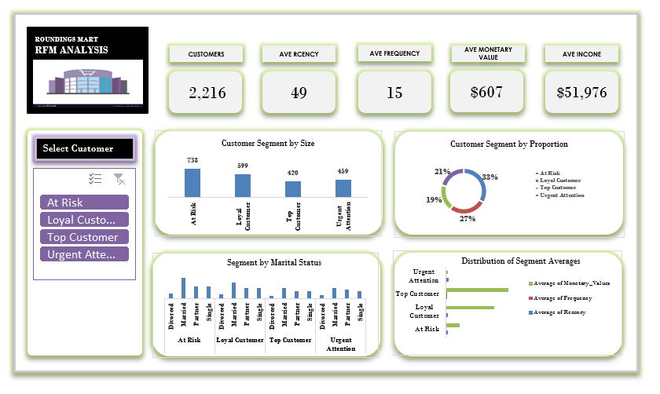
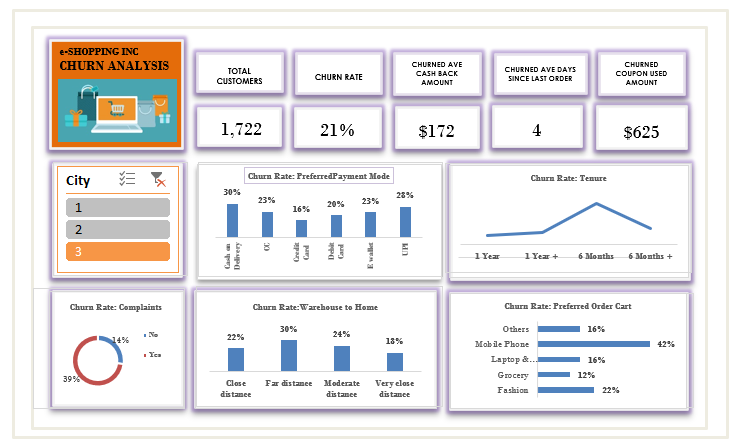
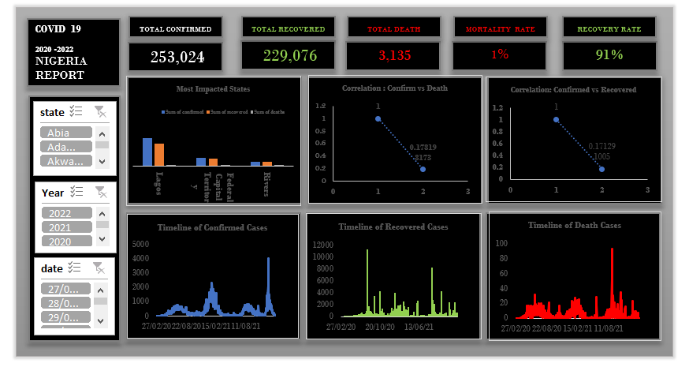
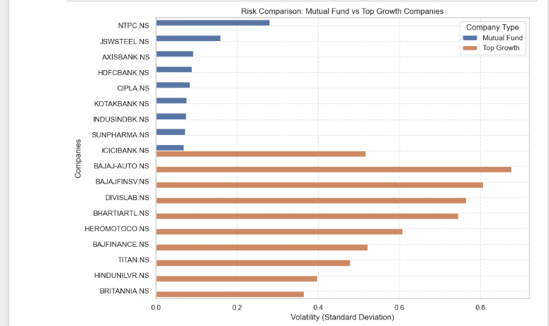

<!--Section 1: Introduce your self-->
## ABOUT ME

Hello! I'm Chijioke Obu 🤓, a data analyst, driven by passion in turning data into actionable insights. With experience across sales, operations, finance, and customer service, I help businesses solve challenges and unlock growth.

<!--Mention your top/relevant skills here - core and soft skills-->
## WHAT I DO

**- ✅ Data Analytics Consulting.**
I provide in-depth analysis and tailored solutions to help businesses make data-driven decisions, optimize processes, and drive business growth. 

**- ✅ Staff Training & Development.**
I offer comprehensive training programs in data analysis, visualization, and data-driven decision-making. From beginner to advanced levels. 

<!--Section 2: List 3-4 key projects-->
## MY PORTFOLIO 

*A glimpse of some of the projects.*

**RFM Analysis.**

[Read More](https://github.com/cobu900/cobu-my-repo/blob/main/rfm_analysis.xlsx)

**Customer Churn Analysis.**

[Read More](https://github.com/cobu900/cobu-my-repo/blob/main/churn%20analysis.xlsx)

**Nigeria Covid 19 Analysis.**

[Read More](https://github.com/cobu900/cobu-my-repo/blob/main/covid_ngr.xlsx)

**Mutual Fund Investment Analysis.**

[Read More](https://www.linkedin.com/pulse/predictive-modeling-hypothesis-testing-using-titanic-dataset-anietie/)

## CONTACT DETAILS

*Let’s connect and see how we can make a difference together!*
<table>
  <tbody>
    <tr>
      <td>📧</td>
      <td><a href="mailto:chijiokeobu100@gmail.com">chijiokeobu100@gmail.com</a></td>
    </tr>
    <tr>
      <td>📞</td>
      <td>(234) 903-464-2404</td>
    </tr>
  </tbody>
</table>

